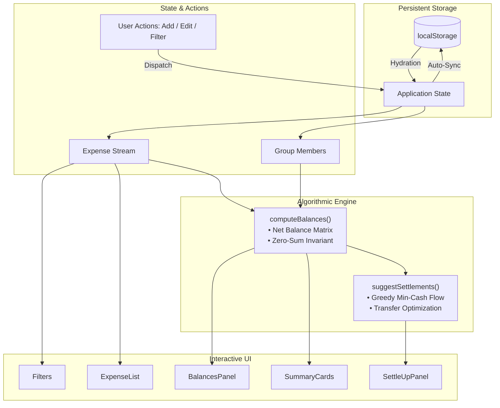

# ⚖️ BalanceKeeper (FairShare)

<div align="center">

[](https://reactjs.org/)
[](https://vitejs.dev/)
[](https://developer.mozilla.org/en-US/docs/Web/JavaScript)
[](LICENSE)
[]()

**A high-precision, zero-loss group expense splitting and debt settlement engine.**

*Track group expenses, calculate exact net balances, and resolve complex peer-to-peer debts in the minimum number of transactions.*

[Features](#-key-features) • [Algorithm & Math](#-algorithmic--mathematical-engine) • [Architecture](#-system-architecture) • [Getting Started](#-getting-started) • [Edge Cases Solved](#-edge-cases--reliability)

---

</div>

## 📌 Overview

When groups travel, share an apartment, or organize events together, keeping track of who paid for what quickly turns into chaotic spreadsheets and endless bank transfers. 

**BalanceKeeper** is built from the ground up to model real-world spending dynamics with mathematical rigor:
- **Zero-Loss Rounding:** Ensures exact penny conservation across equal and percentage splits with no phantom dollars created or lost.
- **Minimum Cash Flow Graph Simplification:** Employs an $O(V \log V)$ greedy settlement algorithm that reduces an $N$-party web of cross-debts into the minimal number of direct transfers.
- **Third-Party Payer Support:** Fully supports real-world scenarios where the person paying is not part of the consumption (e.g. paying for someone else's cab fare or advance booking).

---

## ✨ Key Features

| Feature | Description |
| :--- | :--- |
| 🧮 **Penny-Exact Splitting** | Distribute expenses equally or by custom percentages with automatic remainder distribution to prevent floating-point rounding decay. |
| 🔄 **Optimal Debt Settlement** | Automatically solves the multi-party debt graph and outputs the minimal list of bank transfers needed to square up all balances. |
| 👥 **Non-Participant Payers** | Accurately credits payers who cover bills on behalf of others without unfairly debiting their personal balance. |
| 📊 **Real-Time Financial Dashboard** | Instant visibility into Group Total Spend, Top Spender analytics, and color-coded individual net positions (Owes vs. Owed). |
| 🔍 **Multi-Dimensional Filters** | Real-time search by keyword description, filter by category (`Food`, `Travel`, `Fun`, `Stay`), or isolate transactions by payer. |
| 💾 **Robust State Persistence** | Automatic `localStorage` persistence with seamless date deserialization and state hydration. |
| 🎨 **Dynamic Member Management** | Add group members on the fly with auto-assigned distinct color palettes for intuitive visual tracking. |

---

## 🏗️ System Architecture

BalanceKeeper leverages a unidirectional reactive data flow powered by React `useReducer` and memoized algorithmic pipelines (`useMemo`):



---

## 🧮 Algorithmic & Mathematical Engine

### 1. Remainder-Preserving Allocation (Zero-Loss Guarantee)

Floating-point division often introduces rounding losses (e.g. $\$100 \div 3 = \$33.33 \times 3 = \$99.99$, losing $\$0.01$). BalanceKeeper guarantees zero discrepancy by allocating the exact mathematical remainder to the final participant:

$$\text{Share}_i = \text{round}_2\left(\frac{\text{Amount}}{N}\right) \quad \forall i < N$$
$$\text{Share}_N = \text{Amount} - \sum_{i=1}^{N-1} \text{Share}_i$$

The same invariant is applied to percentage-based distributions:
```javascript
// Remainder distribution ensures: Sum(Shares) === Amount
ids.slice(0, -1).forEach((id) => {
  const share = Number(((amount * Number(percents[id])) / 100).toFixed(2));
  shares[id] = share;
  totalAllocated += share;
});
if (ids.length > 0) {
  shares[ids[ids.length - 1]] = Number((amount - totalAllocated).toFixed(2));
}
```

---

### 2. Net Balance Vector Matrix

For any member $i \in M$, their net balance $B_i$ is computed across all transactions $T$:

$$B_i = \sum_{t \in T, \text{Payer}(t) = i} \text{Amount}(t) - \sum_{t \in T} \text{Share}(t, i)$$

A fundamental invariant holds across the entire group:
$$\sum_{i \in M} B_i = 0$$

- $B_i > 0$: Member is a **Creditor** (is owed money by the group).
- $B_i < 0$: Member is a **Debtor** (owes money to the group).
- $B_i = 0$: Member is **Settled**.

---

### 3. Greedy Minimum Cash-Flow Debt Resolution

To settle debts with the absolute minimum number of peer-to-peer transfers, BalanceKeeper partitions balances into sorted debtor and creditor queues:

```
Algorithm: Greedy Min-Cash-Flow
-------------------------------------------------------------
1. Partition members into Debtors (B < 0) and Creditors (B > 0).
2. Sort Debtors descending by owed amount.
3. Sort Creditors descending by claim amount.
4. While Debtors and Creditors remain:
     d = Max Debtor, c = Max Creditor
     TransferAmount = min(d.amount, c.amount)
     Record transfer: d -> c of TransferAmount
     Update balances: d.amount -= TransferAmount, c.amount -= TransferAmount
     Pop settled parties (amount == 0).
```

This guarantees an optimal settlement plan executed in at most $N - 1$ transfers.

---

## 📁 Project Structure

```text
balance-keeper/
├── index.html                 # HTML5 entry point
├── package.json               # Dependencies and build scripts
├── vite.config.js             # Vite development & build configuration
├── BUGS.md                    # Detailed verification log of solved edge cases
├── src/
│   ├── main.jsx               # Application mount point
│   ├── App.jsx                # Core application container & layout
│   ├── index.css              # Custom styling & responsive design system
│   ├── components/
│   │   ├── AddExpenseForm.jsx # Expense creation form with split validations
│   │   ├── BalancesPanel.jsx  # Net individual balances display
│   │   ├── ExpenseList.jsx    # Reverse-chronological expense feed
│   │   ├── Filters.jsx        # Search and multi-category filtering
│   │   ├── SettleUpPanel.jsx  # Optimized debt transfer instructions
│   │   └── SummaryCards.jsx   # Top-level metrics & group stats
│   ├── data/
│   │   └── seed.json          # Default initialization datasets
│   ├── lib/
│   │   ├── balances.js        # Net balance matrix computation
│   │   ├── format.js          # Date and numeric formatting utilities
│   │   ├── money.js           # Precision money arithmetic & split algorithms
│   │   └── settle.js          # Greedy minimum-cash-flow graph solver
│   └── state/
│       └── store.js           # Reducer, localStorage hydration & persistence
```

---

## 🛡️ Edge Cases & Reliability

This codebase incorporates explicit hardening against common real-world edge cases:

1. **Chronological Stream Ordering:** Correctly displays newest expenses first using timestamp numeric normalization.
2. **Exact Debtor-Creditor Parity:** Settle-up algorithm correctly records transfers when debtor and creditor amounts are identical ($D = C$).
3. **Payer Exclusion Isolation:** Accurately credits a payer who covers an expense without consuming it (zero self-debit).
4. **Date Serialization Hydration:** Automatically recovers native `Date` prototypes from serialized JSON strings on page refresh.
5. **Form Lifecycle Reset:** Inputs and validation states are cleanly cleared immediately upon successful submission.
6. **Floating-Point Tolerance Epsilon:** Accepts percentage splits totaling $100\%$ within floating-point tolerance ($| \sum p - 100 | < 0.01$).
7. **Zero-Sum Remainder Preservation:** Eliminates fractional penny loss in both equal and percentage splits.

---

## 🚀 Getting Started

### Prerequisites
- [Node.js](https://nodejs.org/) (version 18.0.0 or higher recommended)
- [npm](https://www.npmjs.com/) (version 9.0.0 or higher)

### Installation

1. **Clone the repository:**
   ```bash
   git clone https://github.com/Kaipalokesh/balance-keeper.git
   cd balance-keeper
   ```

2. **Install dependencies:**
   ```bash
   npm install
   ```

3. **Start the development server:**
   ```bash
   npm run dev
   ```
   Open `http://localhost:5173` in your browser to view the app.

4. **Build for production:**
   ```bash
   npm run build
   ```

5. **Preview production build:**
   ```bash
   npm run preview
   ```

---

## 🛠️ Tech Stack

- **Framework:** [React 18](https://reactjs.org/) (Hooks: `useReducer`, `useMemo`, `useState`, `useEffect`)
- **Build Tool:** [Vite 6](https://vitejs.dev/)
- **Styling:** Modern CSS3 with Custom Properties & Grid/Flexbox Layouts
- **Algorithms:** Pure ES6+ Functional Graph & Arithmetic Utilities (Zero third-party runtime math dependencies)

---

## 📄 License

This project is licensed under the **MIT License** — feel free to use and modify for personal or commercial projects.

<div align="center">

Made with ❤️ by [Kaipalokesh](https://github.com/Kaipalokesh)

</div>
